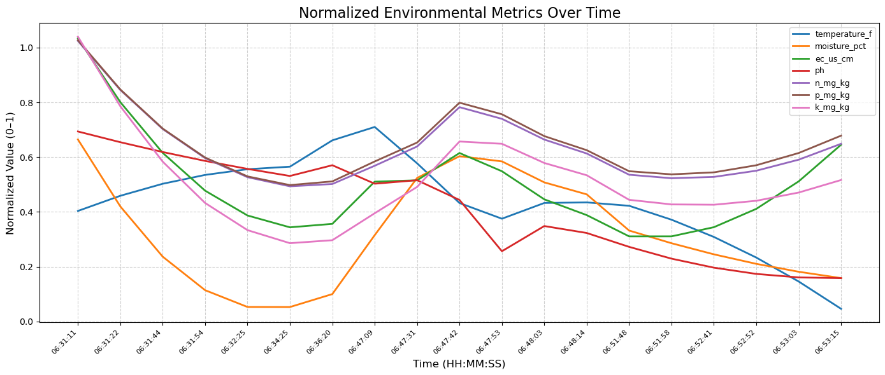
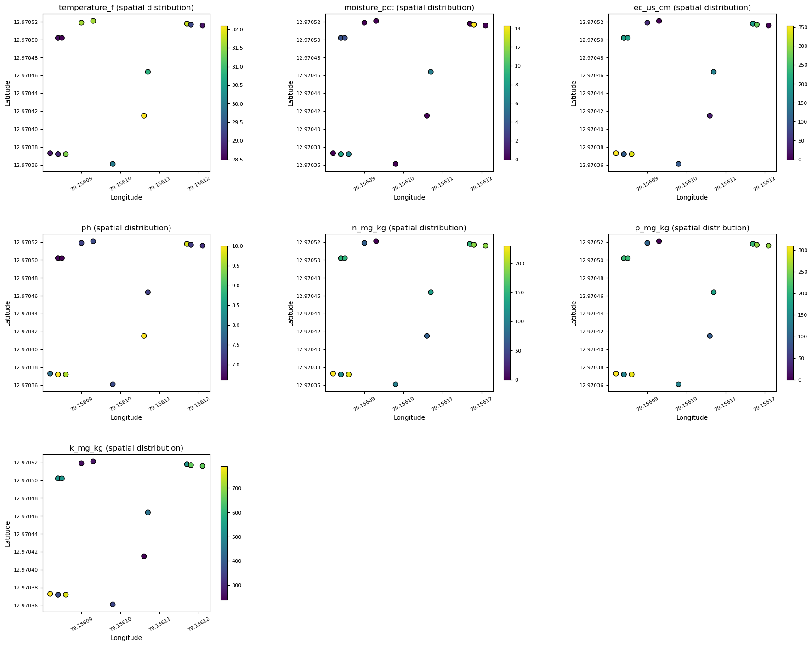
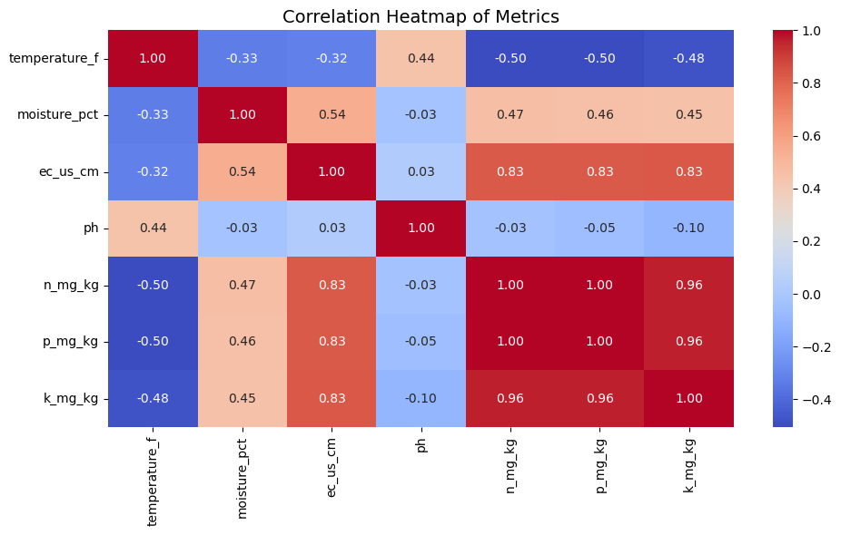
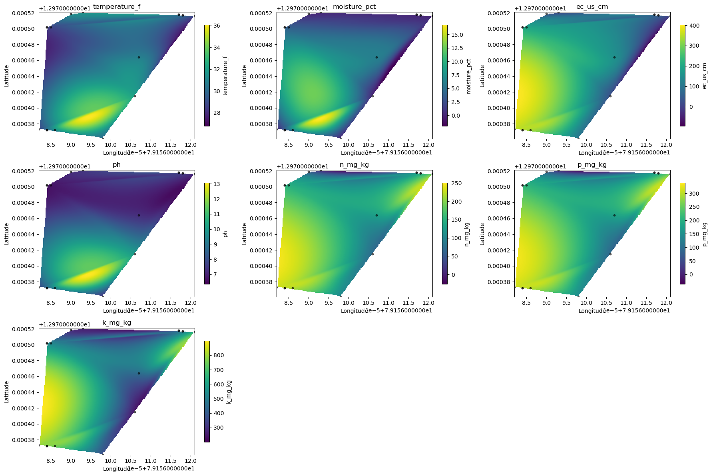
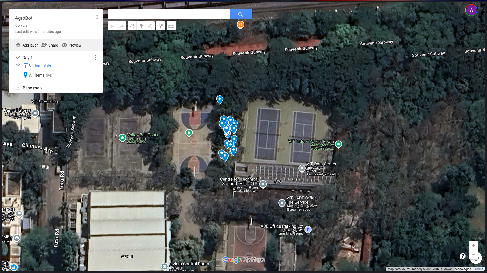

# Environmental Data Analysis

This notebook analyzes environmental data collected by the agro rover across the field. We'll import necessary libraries and load the cleaned sensor data for comprehensive analysis.

    First 10 rows of the clean environmental data:
    | timestamp                  |   camera_id | image_path                                |   latitude |   longitude |   temperature_f |   moisture_pct |   ec_us_cm |    ph |   n_mg_kg |   p_mg_kg |   k_mg_kg |
    |:---------------------------|------------:|:------------------------------------------|-----------:|------------:|----------------:|---------------:|-----------:|------:|----------:|----------:|----------:|
    | 1970-01-01T06:31:11.739203 |           0 | capture_data/cam0_1970-01-01_06-31-11.jpg |    12.9704 |     79.1561 |            31.4 |            6.7 |        337 |  9.59 |       220 |       300 |       760 |
    | 1970-01-01T06:31:22.772735 |           0 | capture_data/cam0_1970-01-01_06-31-22.jpg |    12.9704 |     79.1561 |            30.1 |            6.7 |        338 |  7.67 |       220 |       300 |       770 |
    | 1970-01-01T06:31:44.327990 |           0 | capture_data/cam0_1970-01-01_06-31-44.jpg |    12.9704 |     79.1561 |            28.9 |            8.5 |        106 | 10    |       110 |       140 |       370 |
    | 1970-01-01T06:31:54.540762 |           0 | capture_data/cam0_1970-01-01_06-31-54.jpg |    12.9704 |     79.1561 |            28.7 |            0   |        354 |  7.85 |       230 |       310 |       790 |
    | 1970-01-01T06:32:25.187522 |           0 | capture_data/cam0_1970-01-01_06-32-25.jpg |    12.9704 |     79.1561 |            30   |            0   |        100 |  7.41 |       100 |       140 |       360 |
    | 1970-01-01T06:34:25.138680 |           0 | capture_data/cam0_1970-01-01_06-34-25.jpg |    12.9704 |     79.1561 |            32.1 |            0   |         28 | 10    |        70 |        90 |       240 |
    | 1970-01-01T06:36:20.846582 |           0 | capture_data/cam0_1970-01-01_06-36-20.jpg |    12.9705 |     79.1561 |            30.8 |            6.1 |        154 |  7.27 |       130 |       180 |       450 |
    | 1970-01-01T06:47:09.572071 |           0 | capture_data/cam0_1970-01-01_06-47-09.jpg |    12.9705 |     79.1561 |            30.9 |            0   |        100 |  7.88 |       100 |       140 |       360 |
    | 1970-01-01T06:47:31.639204 |           0 | capture_data/cam0_1970-01-01_06-47-31.jpg |    12.9705 |     79.1561 |            31.8 |            0   |        200 |  9.79 |       150 |       210 |       530 |
    | 1970-01-01T06:47:42.675368 |           0 | capture_data/cam0_1970-01-01_06-47-42.jpg |    12.9705 |     79.1561 |            29.6 |           14.1 |        272 |  8.3  |       190 |       260 |       650 |

## Time Series Analysis

### Individual Metric Trends Over Time

Create a comprehensive time series plot showing how each environmental metric changes over time. We'll display both raw data points and smoothed trend lines using Savitzky-Golay filtering to better visualize patterns and trends.

### Normalized Metrics Comparison

Normalize all environmental metrics to a 0-1 scale and plot them together. This allows us to compare the relative changes of different metrics on the same scale and identify correlations between various environmental parameters.

    

    

## Spatial Analysis

### Geographic Distribution of Environmental Metrics

Visualize how each environmental metric varies across the field using scatter plots. Each point represents a measurement location with color-coded values showing the spatial distribution and helping identify areas with similar characteristics or potential hotspots.

    

    

## Statistical Analysis

### Correlation Between Environmental Metrics

Generate a correlation heatmap to understand the statistical relationships between different environmental parameters. This helps identify which factors are interconnected and may influence each other in the agricultural system.

    

    

### Spatial Interpolation Heatmaps

Create continuous spatial heatmaps using interpolation to show smooth distributions of each environmental metric across the field. This provides a comprehensive view of spatial patterns and gradients that can guide precision agriculture decisions.

    

    

## Additional Data Exploration

### Coordinate Data Analysis

Load and examine the coordinate data to understand the spatial coverage and sampling pattern of the agro rover's data collection across the field.

<table border="1" class="dataframe">
  <thead>
    <tr style="text-align: right;">
      <th></th>
      <th>latitude</th>
      <th>longitude</th>
    </tr>
  </thead>
  <tbody>
    <tr>
      <th>0</th>
      <td>12.970372</td>
      <td>79.156087</td>
    </tr>
    <tr>
      <th>1</th>
      <td>12.970372</td>
      <td>79.156086</td>
    </tr>
    <tr>
      <th>2</th>
      <td>12.970372</td>
      <td>79.156086</td>
    </tr>
    <tr>
      <th>3</th>
      <td>12.970372</td>
      <td>79.156084</td>
    </tr>
    <tr>
      <th>4</th>
      <td>12.970373</td>
      <td>79.156082</td>
    </tr>
    <tr>
      <th>5</th>
      <td>12.970361</td>
      <td>79.156098</td>
    </tr>
    <tr>
      <th>6</th>
      <td>12.970361</td>
      <td>79.156098</td>
    </tr>
    <tr>
      <th>7</th>
      <td>12.970362</td>
      <td>79.156098</td>
    </tr>
    <tr>
      <th>8</th>
      <td>12.970362</td>
      <td>79.156098</td>
    </tr>
    <tr>
      <th>9</th>
      <td>12.970362</td>
      <td>79.156097</td>
    </tr>
  </tbody>
</table>

    

    

## Sample Field Images

Display sample images captured by the agro rover during its field survey to provide visual context for the environmental data analysis.

    

    

