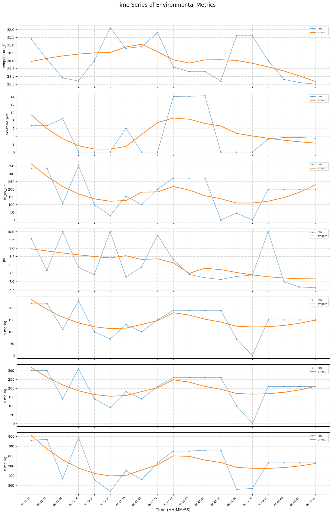

# Environmental Data Analysis

This notebook analyzes environmental data collected by the agro rover across the field. We'll import necessary libraries and load the cleaned sensor data for comprehensive analysis.


```python
# Display first 10 rows of the clean data
print("First 10 rows of the clean environmental data:")
df.head(10)
```

    First 10 rows of the clean environmental data:


<div>
<style scoped>
    .dataframe tbody tr th:only-of-type {
        vertical-align: middle;
    }

    .dataframe tbody tr th {
        vertical-align: top;
    }

    .dataframe thead th {
        text-align: right;
    }
</style>
<table border="1" class="dataframe">
  <thead>
    <tr style="text-align: right;">
      <th></th>
      <th>timestamp</th>
      <th>camera_id</th>
      <th>image_path</th>
      <th>latitude</th>
      <th>longitude</th>
      <th>temperature_f</th>
      <th>moisture_pct</th>
      <th>ec_us_cm</th>
      <th>ph</th>
      <th>n_mg_kg</th>
      <th>p_mg_kg</th>
      <th>k_mg_kg</th>
      <th>time_str</th>
    </tr>
  </thead>
  <tbody>
    <tr>
      <th>0</th>
      <td>1970-01-01 06:31:11.739203</td>
      <td>0</td>
      <td>capture_data/cam0_1970-01-01_06-31-11.jpg</td>
      <td>12.970372</td>
      <td>79.156086</td>
      <td>31.4</td>
      <td>6.7</td>
      <td>337.0</td>
      <td>9.59</td>
      <td>220.0</td>
      <td>300.0</td>
      <td>760.0</td>
      <td>06:31:11</td>
    </tr>
    <tr>
      <th>1</th>
      <td>1970-01-01 06:31:22.772735</td>
      <td>0</td>
      <td>capture_data/cam0_1970-01-01_06-31-22.jpg</td>
      <td>12.970372</td>
      <td>79.156084</td>
      <td>30.1</td>
      <td>6.7</td>
      <td>338.0</td>
      <td>7.67</td>
      <td>220.0</td>
      <td>300.0</td>
      <td>770.0</td>
      <td>06:31:22</td>
    </tr>
    <tr>
      <th>2</th>
      <td>1970-01-01 06:31:44.327990</td>
      <td>0</td>
      <td>capture_data/cam0_1970-01-01_06-31-44.jpg</td>
      <td>12.970372</td>
      <td>79.156084</td>
      <td>28.9</td>
      <td>8.5</td>
      <td>106.0</td>
      <td>10.00</td>
      <td>110.0</td>
      <td>140.0</td>
      <td>370.0</td>
      <td>06:31:44</td>
    </tr>
    <tr>
      <th>3</th>
      <td>1970-01-01 06:31:54.540762</td>
      <td>0</td>
      <td>capture_data/cam0_1970-01-01_06-31-54.jpg</td>
      <td>12.970373</td>
      <td>79.156082</td>
      <td>28.7</td>
      <td>0.0</td>
      <td>354.0</td>
      <td>7.85</td>
      <td>230.0</td>
      <td>310.0</td>
      <td>790.0</td>
      <td>06:31:54</td>
    </tr>
    <tr>
      <th>4</th>
      <td>1970-01-01 06:32:25.187522</td>
      <td>0</td>
      <td>capture_data/cam0_1970-01-01_06-32-25.jpg</td>
      <td>12.970361</td>
      <td>79.156098</td>
      <td>30.0</td>
      <td>0.0</td>
      <td>100.0</td>
      <td>7.41</td>
      <td>100.0</td>
      <td>140.0</td>
      <td>360.0</td>
      <td>06:32:25</td>
    </tr>
    <tr>
      <th>5</th>
      <td>1970-01-01 06:34:25.138680</td>
      <td>0</td>
      <td>capture_data/cam0_1970-01-01_06-34-25.jpg</td>
      <td>12.970415</td>
      <td>79.156106</td>
      <td>32.1</td>
      <td>0.0</td>
      <td>28.0</td>
      <td>10.00</td>
      <td>70.0</td>
      <td>90.0</td>
      <td>240.0</td>
      <td>06:34:25</td>
    </tr>
    <tr>
      <th>6</th>
      <td>1970-01-01 06:36:20.846582</td>
      <td>0</td>
      <td>capture_data/cam0_1970-01-01_06-36-20.jpg</td>
      <td>12.970464</td>
      <td>79.156107</td>
      <td>30.8</td>
      <td>6.1</td>
      <td>154.0</td>
      <td>7.27</td>
      <td>130.0</td>
      <td>180.0</td>
      <td>450.0</td>
      <td>06:36:20</td>
    </tr>
    <tr>
      <th>7</th>
      <td>1970-01-01 06:47:09.572071</td>
      <td>0</td>
      <td>capture_data/cam0_1970-01-01_06-47-09.jpg</td>
      <td>12.970518</td>
      <td>79.156117</td>
      <td>30.9</td>
      <td>0.0</td>
      <td>100.0</td>
      <td>7.88</td>
      <td>100.0</td>
      <td>140.0</td>
      <td>360.0</td>
      <td>06:47:09</td>
    </tr>
    <tr>
      <th>8</th>
      <td>1970-01-01 06:47:31.639204</td>
      <td>0</td>
      <td>capture_data/cam0_1970-01-01_06-47-31.jpg</td>
      <td>12.970518</td>
      <td>79.156117</td>
      <td>31.8</td>
      <td>0.0</td>
      <td>200.0</td>
      <td>9.79</td>
      <td>150.0</td>
      <td>210.0</td>
      <td>530.0</td>
      <td>06:47:31</td>
    </tr>
    <tr>
      <th>9</th>
      <td>1970-01-01 06:47:42.675368</td>
      <td>0</td>
      <td>capture_data/cam0_1970-01-01_06-47-42.jpg</td>
      <td>12.970517</td>
      <td>79.156118</td>
      <td>29.6</td>
      <td>14.1</td>
      <td>272.0</td>
      <td>8.30</td>
      <td>190.0</td>
      <td>260.0</td>
      <td>650.0</td>
      <td>06:47:42</td>
    </tr>
  </tbody>
</table>
</div>


## Time Series Analysis

### Individual Metric Trends Over Time

Create a comprehensive time series plot showing how each environmental metric changes over time. We'll display both raw data points and smoothed trend lines using Savitzky-Golay filtering to better visualize patterns and trends.


```python
df["time_str"] = pd.to_datetime(df["timestamp"]).dt.strftime("%H:%M:%S")

fig, axes = plt.subplots(len(metrics), 1, figsize=(14, 3*len(metrics)), sharex=True)

for i, col in enumerate(metrics):
    ax = axes[i]
    
    # X and Y values
    x = np.arange(len(df))  # numeric index for plotting
    y = df[col].values.astype(float)
    
    # Plot raw points
    ax.plot(x, y, marker="o", markersize=3, linestyle="-", alpha=0.6, label="raw")
    
    # Smoothed curve with Savitzky-Golay filter (fallback to rolling mean if not enough points)
    window = min(11, len(y) if len(y) % 2 == 1 else len(y)-1)  # odd window ≤ data length
    if window >= 5:  
        y_smooth = savgol_filter(y, window, polyorder=2)
    else:
        y_smooth = pd.Series(y).rolling(window=3, min_periods=1).mean().to_numpy()
    
    ax.plot(x, y_smooth, linewidth=2, label="smooth")
    
    # Axis formatting
    ax.set_ylabel(col, fontsize=10)
    ax.grid(True, linestyle="--", alpha=0.6)
    ax.legend(fontsize=8)
    
    # Add time labels for each subplot
    step = max(1, len(x)//10)  # about 10 ticks
    ax.set_xticks(x[::step])
    ax.set_xticklabels(df["time_str"].iloc[::step], rotation=45, ha="right", fontsize=8)

# Shared X label
axes[-1].set_xlabel("Time (HH:MM:SS)", fontsize=12)

plt.suptitle("Time Series of Environmental Metrics", fontsize=16, y=1.02)
plt.tight_layout()
plt.savefig("./plots/time_series_environmental_metrics.png", dpi=300, bbox_inches="tight")
plt.show()

```


    

    


### Normalized Metrics Comparison

Normalize all environmental metrics to a 0-1 scale and plot them together. This allows us to compare the relative changes of different metrics on the same scale and identify correlations between various environmental parameters.


```python
# Convert timestamp to readable format
df["time_str"] = pd.to_datetime(df["timestamp"]).dt.strftime("%H:%M:%S")


# Normalize metrics (0–1 scaling)
scaler = MinMaxScaler()
df_norm = df.copy()
df_norm[metrics] = scaler.fit_transform(df[metrics].astype(float))

# Plot smoothed normalized values on same graph
fig, ax = plt.subplots(figsize=(14, 6))

x = np.arange(len(df))

for col in metrics:
    y = df_norm[col].values
    
    # Smooth with Savitzky-Golay or rolling mean
    window = min(11, len(y) if len(y) % 2 == 1 else len(y)-1)
    if window >= 5:
        y_smooth = savgol_filter(y, window, polyorder=2)
    else:
        y_smooth = pd.Series(y).rolling(window=3, min_periods=1).mean().to_numpy()
    
    ax.plot(x, y_smooth, linewidth=2, label=col)

# X-axis labels (time)
step = max(1, len(x)//10)
ax.set_xticks(x[::step])
ax.set_xticklabels(df["time_str"].iloc[::step], rotation=45, ha="right", fontsize=8)

ax.set_xlabel("Time (HH:MM:SS)", fontsize=12)
ax.set_ylabel("Normalized Value (0–1)", fontsize=12)
ax.set_title("Normalized Environmental Metrics Over Time", fontsize=16)
ax.legend(fontsize=9)
ax.grid(True, linestyle="--", alpha=0.6)

plt.tight_layout()
plt.savefig("./plots/normalized_metrics_over_time.png", dpi=300, bbox_inches="tight")
plt.show()
```


    

    


## Spatial Analysis

### Geographic Distribution of Environmental Metrics

Visualize how each environmental metric varies across the field using scatter plots. Each point represents a measurement location with color-coded values showing the spatial distribution and helping identify areas with similar characteristics or potential hotspots.


```python
# remove_cell
# ---------- FIXED SPATIAL SCATTER PLOTS (no scientific notation overlap) ----------
n_metrics = len(metrics)
n_cols = 3  # up to 3 plots per row
n_rows = math.ceil(n_metrics / n_cols)

fig, axes = plt.subplots(n_rows, n_cols, figsize=(6*n_cols, 5*n_rows))
axes = axes.flatten()

for i, col in enumerate(metrics):
    sc = axes[i].scatter(
        df["longitude"].to_numpy().ravel(),
        df["latitude"].to_numpy().ravel(),
        c=df[col].to_numpy().ravel(),
        cmap="viridis", s=60, edgecolor="k"
    )
    axes[i].set_title(f"{col} (spatial distribution)", fontsize=12)
    axes[i].set_xlabel("Longitude")
    axes[i].set_ylabel("Latitude")

    # Force plain formatting (no scientific notation)
    axes[i].xaxis.set_major_formatter(mticker.ScalarFormatter(useOffset=False))
    axes[i].yaxis.set_major_formatter(mticker.ScalarFormatter(useOffset=False))

    # Rotate ticks for clarity
    for label in axes[i].get_xticklabels():
        label.set_rotation(30)
        label.set_fontsize(8)
    for label in axes[i].get_yticklabels():
        label.set_fontsize(8)

    cbar = plt.colorbar(sc, ax=axes[i], shrink=0.85)
    cbar.ax.tick_params(labelsize=8)

# Hide unused axes
for j in range(n_metrics, len(axes)):
    fig.delaxes(axes[j])

plt.tight_layout()
plt.subplots_adjust(top=0.92, hspace=0.4, wspace=0.35)
plt.savefig("./plots/spatial_scatter_plots.png", dpi=300, bbox_inches="tight")
plt.show()
```


    

    


## Statistical Analysis

### Correlation Between Environmental Metrics

Generate a correlation heatmap to understand the statistical relationships between different environmental parameters. This helps identify which factors are interconnected and may influence each other in the agricultural system.


```python
# remove_cell
plt.figure(figsize=(10, 6))
corr = df[metrics].corr()
sns.heatmap(corr, annot=True, cmap="coolwarm", fmt=".2f")
plt.title("Correlation Heatmap of Metrics", fontsize=14)
plt.tight_layout()
plt.savefig("./plots/correlation_heatmap.png", dpi=300, bbox_inches="tight")
plt.show()
```


    

    


### Spatial Interpolation Heatmaps

Create continuous spatial heatmaps using interpolation to show smooth distributions of each environmental metric across the field. This provides a comprehensive view of spatial patterns and gradients that can guide precision agriculture decisions.


```python
# remove_cell
df_clean = df.dropna(subset=["latitude", "longitude"] + metrics)

lat = df_clean["latitude"].values
lon = df_clean["longitude"].values

# Define voxel grid resolution (increase 200j for smoother maps)
grid_x, grid_y = np.mgrid[
    lon.min():lon.max():200j,
    lat.min():lat.max():200j
]

# Subplots
n = len(metrics)
cols = 3
rows = int(np.ceil(n / cols))

fig, axes = plt.subplots(rows, cols, figsize=(18, 12))
axes = axes.flatten()

for i, metric in enumerate(metrics):
    values = df_clean[metric].values

    try:
        grid_z = griddata((lon, lat), values, (grid_x, grid_y), method="cubic")
    except Exception:
        grid_z = griddata((lon, lat), values, (grid_x, grid_y), method="linear")

    # Plot heatmap
    im = axes[i].imshow(
        grid_z.T, extent=(lon.min(), lon.max(), lat.min(), lat.max()),
        origin="lower", cmap="viridis", aspect="auto"
    )
    fig.colorbar(im, ax=axes[i], label=metric, shrink=0.8)
    axes[i].scatter(lon, lat, c="k", s=10, alpha=0.6)
    axes[i].set_title(metric)
    axes[i].set_xlabel("Longitude")
    axes[i].set_ylabel("Latitude")

# Hide unused axes
for j in range(i + 1, len(axes)):
    axes[j].axis("off")

plt.tight_layout()
plt.savefig("./plots/spatial_heatmaps.png", dpi=300, bbox_inches="tight")
plt.show()
```


    

    


## Additional Data Exploration

### Coordinate Data Analysis

Load and examine the coordinate data to understand the spatial coverage and sampling pattern of the agro rover's data collection across the field.


```python
# remove_cell
## Coordinate Data
coor_data = pd.read_csv("./coordinate_data.csv")
coor_data.head(10)

# Display the map plot
from IPython.display import Image, display
display(Image("./support_images/map_plot.png"))
```


    

    

