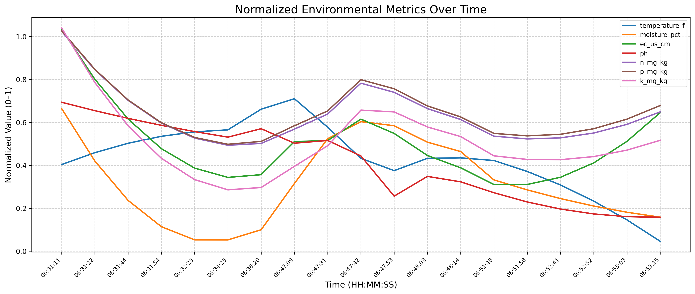

# Agro Rover

Analyzes soil/environmental data collected across the field.

## Graph Plots

### Time Series Environmental Metrics

This plot shows the temporal evolution of key environmental metrics including temperature, moisture, electrical conductivity (EC), pH, and nutrient levels (N, P, K) over time. Each metric is displayed in its own subplot with both raw data points and smoothed trend lines using Savitzky-Golay filtering to highlight patterns and trends in the collected data.

### Normalized Environmental Metrics Over Time

A comprehensive view of all environmental metrics normalized to a 0-1 scale and plotted together over time. This visualization allows for easy comparison of different metrics' relative changes and helps identify correlations and patterns between various environmental parameters throughout the data collection period.

### Spatial Scatter Plots

Geographic distribution of environmental metrics across the field shown as scatter plots. Each subplot represents a different metric (temperature, moisture, EC, pH, N, P, K) with color-coded points indicating the measured values at specific latitude and longitude coordinates. This helps identify spatial patterns and hotspots in the field.

### Correlation Heatmap

A correlation matrix heatmap showing the statistical relationships between all measured environmental metrics. The color intensity and numerical values indicate the strength and direction of correlations, helping to understand which environmental factors are interconnected and may influence each other.

### Spatial Heatmaps

Interpolated spatial heatmaps showing the continuous distribution of each environmental metric across the field. Using cubic interpolation, these maps provide a smooth representation of how each parameter varies geographically, making it easy to identify zones with similar characteristics and spatial gradients in the field conditions.
